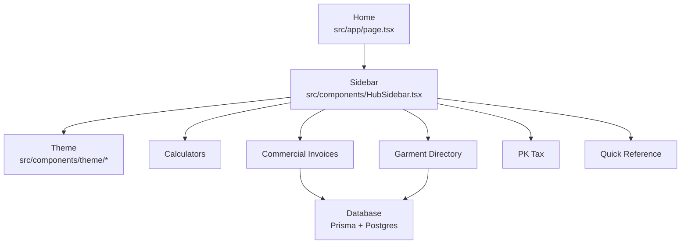
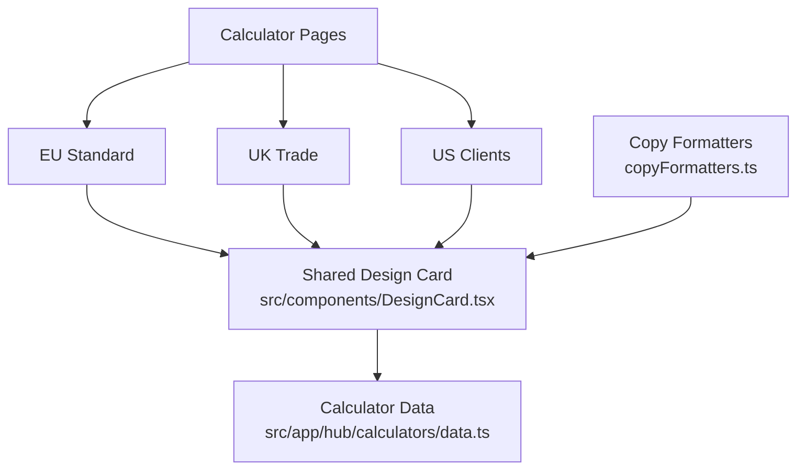
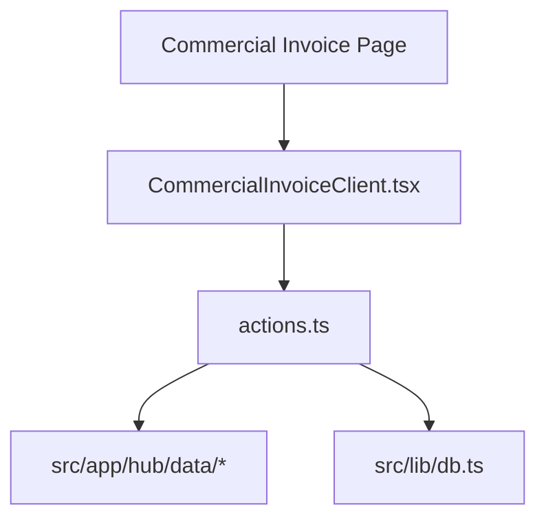
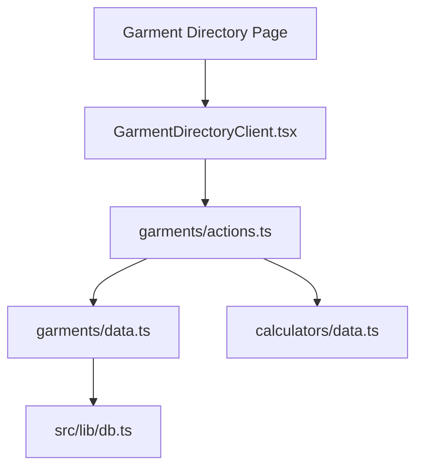
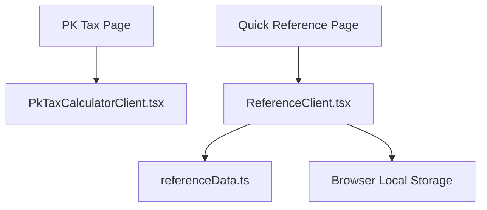
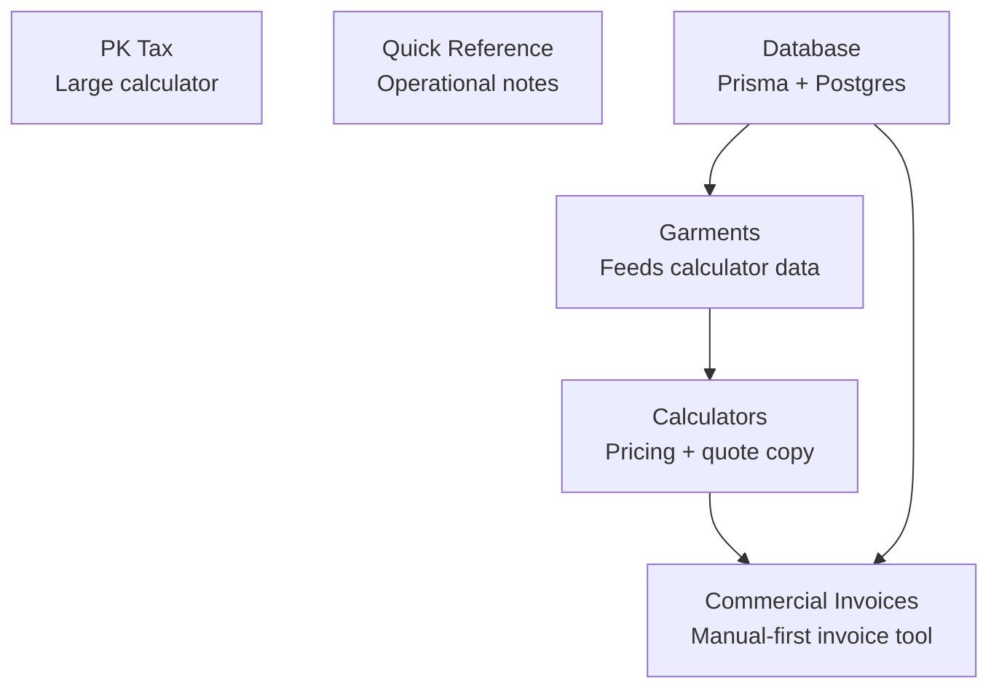

# Pins Hub Visual Repo Map

This file gives a compact visual overview of the main Pins Hub feature areas. It is intentionally split into smaller Mermaid diagrams so it stays readable in Obsidian, VS Code, and GitHub.

## 1. System Overview

## 2. Calculators

## 3. Commercial Invoices

## 4. Garments

## 5. Referrals

Removed/deferred. `/hub/referrals`, `/ref/[code]`, referral route files, and referral/loyalty Prisma models are no longer active.

## 6. PK Tax and Quick Reference

## 7. Feature Hotspots

